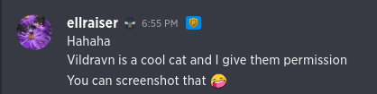

This is a Python script that leverages the power of Imagemagick to make certain aspects of modding APICO easier.

[Changelog](CHANGELOG.md)

🐝 All images used in this tool belong to [TNGineers](https://twitter.com/TNgineers) and are used and distributed with their permission.



## Features

* Generates text images using the font used in the menu object titles
* Generates spritesheets with mouseover and undiscovered versions of items out of a single item sprite
  * Can optionally add the dark outline to the source sprite

## Installation

1. Install Python 3
    * **Debian/Ubuntu Liunx**: `sudo apt install python3 python3-dev python-venv`
    * **macOS**: `brew install python` ([Homebrew](https://brew.sh)) or `xcode-select --install` 
    * **Windows**: `choco install python` ([Chocolatey](https://chocolatey.org/install)) or [Download the installer](https://www.python.org/downloads/windows/)
1. Install ImageMagick
    * [**Debian/Ubuntu Linux**](https://docs.wand-py.org/en/0.6.7/guide/install.html#install-imagemagick-on-debian-ubuntu)
    * [**macOS**](https://docs.wand-py.org/en/0.6.7/guide/install.html#install-imagemagick-on-mac)
    * [**Windows**](https://docs.wand-py.org/en/0.6.7/guide/install.html#install-imagemagick-on-windows)
1. Use `venv` to isolate your environment
    ```bash
    python -m venv env
    
    # Linux and macOS
    source env/bin/activate

    # Windows
    .\env\bin\activate
    ```
1. Install the dependencies
    ```bash
    pip install -r requirements.txt
    ```
## Usage
1. Activate your isolated environment
    ```bash
    # Linux and macOS
    source env/bin/activate

     # Windows
    .\env\bin\activate
    ```
1. Run the script
    ```bash
    ./run.py -h
    ```

### Generate a text image

```bash
./run.py text -string "I love apico" -color "#d89d41" -output "text.png"
```


### Generate a spritesheet

From a sprite that already has a dark outline

```
./run.py spritesheet -sprite jalapeno.png -output jalapeno_sheet.png
```


From a sprite that doesn't have a dark outline

```
./run.py spritesheet -sprite book.png -output book_sheet.png -darkoutline 1
```

